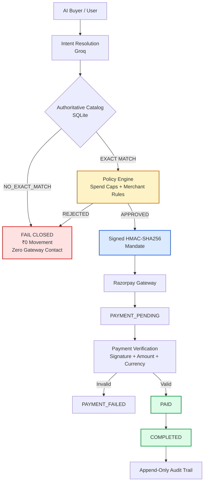
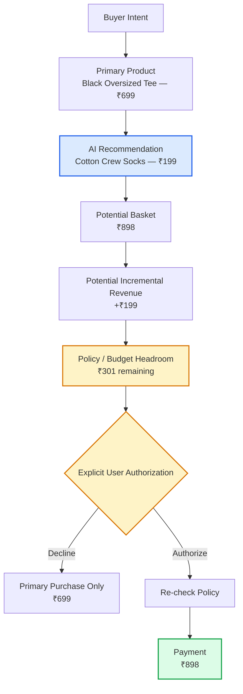
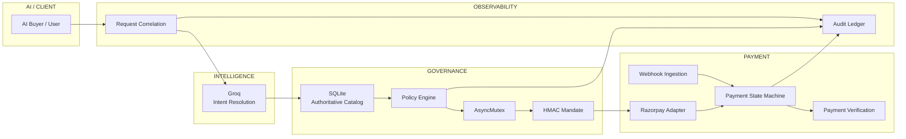
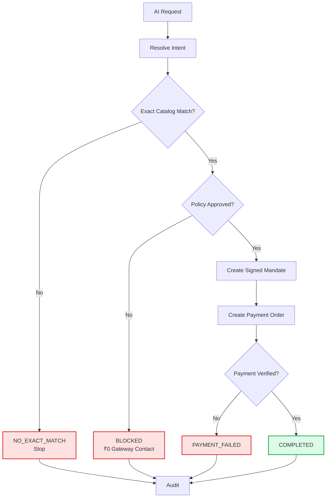
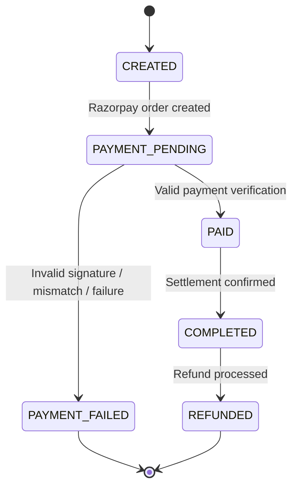
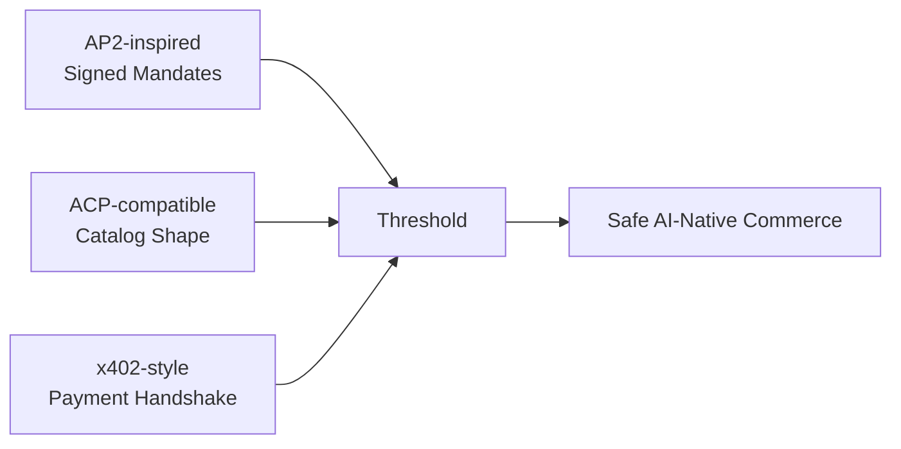

# THRESHOLD

### Safe AI-Native Commerce & Revenue Growth for Merchants

> **Make merchants sellable to AI buyers while helping them grow revenue — with every money action explainable, bounded, and gated.**

**Built for the Razorpay AI Buildathon 2026 — Track: AI Growth & Agentic Commerce**

[](https://www.typescriptlang.org/)
[](https://react.dev/)
[](https://razorpay.com/)
[](https://groq.com/)
[](#verification)
[](LICENSE)

---

## Overview

AI commerce is moving from product discovery toward AI agents that can actually execute purchases.

That creates two problems for merchants:
1. **How do I make my products understandable and purchasable by AI buyers?**
2. **How do I increase basket value without giving an AI unrestricted authority over money?**

Threshold solves both.

It connects:
`Buyer Intent → Catalog Understanding → Product Match → Policy → Payment → Audit`

while running a separate:
`Buyer Intent → Cross-Sell Opportunity → Budget Check → User Authorization → Payment`

The fundamental safety rule is:
> ### **Recommendation ≠ Authorization**
> An AI can identify an opportunity to increase basket value. It cannot silently purchase that additional item.

---

## Table of Contents
- [The Product](#the-product)
- [Core Commerce Flow](#core-commerce-flow)
- [Merchant Growth Loop](#merchant-growth-loop)
- [Why Threshold](#why-threshold)
- [System Architecture](#system-architecture)
- [Safety Architecture](#safety-architecture)
- [Payment Lifecycle](#payment-lifecycle)
- [Protocol Positioning](#protocol-positioning)
- [Verification](#verification)
- [API Surface](#api-surface)
- [Tech Stack](#tech-stack)
- [Quick Start](#quick-start)
- [Environment Configuration](#environment-configuration)
- [Build Challenges](#build-challenges)
- [Honest Scope & Limitations](#honest-scope--limitations)
- [Project Structure](#project-structure)
- [License](#license)

---

## The Product

Threshold is a full-stack AI-native commerce engine built around two connected capabilities:

| 🤖 AI Buyer Commerce | 📈 Merchant Revenue Growth |
|---|---|
| Natural-language purchase intent | Contextual cross-sell / upsell |
| AI-readable product catalog | Potential basket-value increase |
| Exact catalog grounding | Budget-aware recommendations |
| Independent server-side policy | Incremental revenue opportunity |
| Cryptographically signed authorization | Explicit user authorization |
| Razorpay payment lifecycle | AI-powered growth intelligence |
| Append-only audit trail | Simulated intent-matching benchmarks |

The result is a commerce system where AI can help discover, recommend, and transact, while financial authority remains explicitly bounded.

---

## Core Commerce Flow



### The critical boundary
A request does not go directly from:
`AI → Payment`

Instead:
`AI ↓ Catalog ↓ Policy ↓ Authorization ↓ Payment ↓ Verification ↓ Audit`

Every stage can stop the transaction.

---

## Merchant Growth Loop

Threshold's revenue-growth layer is deliberately separated from payment authority.



### Example

| Metric | Value |
|---|---|
| **Primary Purchase** | Black Oversized Tee |
| **Primary Price** | ₹699 |
| **AI Recommendation** | Cotton Crew Socks |
| **Recommendation Price** | ₹199 |
| **Potential Basket** | ₹898 |
| **Potential Incremental Revenue** | +₹199 |
| **Policy Headroom** | ₹301 |
| **Authorization** | Required |

> **Important**: These values represent a potential opportunity / simulated benchmark. They are not presented as guaranteed merchant revenue.

---

## Why Threshold

| Capability | What Threshold Provides |
|---|---|
| **AI Buyer Commerce** | Natural-language purchasing goals resolved through Groq and grounded against real catalog products |
| **Agent-Readable Catalog** | Machine-readable `/catalog/acp` feed and discovery manifest |
| **Exact-Match Grounding** | AI cannot invent or silently substitute unavailable products |
| **Revenue Growth** | Contextual cross-sell and upsell opportunities |
| **Budget Awareness** | Recommendations are evaluated against available policy headroom |
| **Policy Safety** | Independent backend spending and merchant controls |
| **Payment Safety** | Deterministic lifecycle, signature verification, webhooks and refunds |
| **Idempotency** | Duplicate requests cannot create duplicate payment orders |
| **Concurrency Safety** | Serialized policy evaluation prevents race-condition overspending |
| **Auditability** | Request IDs and append-only lifecycle events provide traceability |

---

## System Architecture



### Architectural principle
- **AI provides intelligence.**
- **The backend provides authority.**

This means an LLM failure, hallucination, malformed response, duplicate request, policy violation, or payment-verification failure cannot independently authorize money movement.

---

## Safety Architecture

| Protection | Enforcement |
|---|---|
| **Gated Money Movement** | Only APPROVED policy decisions may initiate a gateway order |
| **Fail Closed** | AI, parsing, policy or upstream failures cannot authorize payment |
| **Exact-Match Grounding** | `NO_EXACT_MATCH` prevents autonomous product substitution |
| **Transaction Limit** | Default per-transaction cap of ₹1,000 |
| **Session Limit** | Default cumulative session cap of ₹1,500 |
| **Merchant Controls** | Authorized merchant / catalog checks |
| **Idempotency** | `run_id` and `Idempotency-Key` prevent duplicate orders |
| **Concurrency Control** | `AsyncMutex` serializes spend evaluation |
| **Payment Verification** | HMAC signature, amount and currency validation |
| **Authorization Boundary** | Cross-sell recommendations require explicit user action |
| **Secret Protection** | Secrets are not returned through health or diagnostics |
| **Auditability** | Decisions and payment lifecycle events are recorded |

### Safety decision flow



---

## Payment Lifecycle



The lifecycle is deterministic and prevents an order from being marked `COMPLETED` without successful payment verification.

---

## Protocol Positioning

Threshold is designed for interoperability with emerging agentic-commerce patterns. It does not claim third-party certification.



| Protocol | Threshold Implementation |
|---|---|
| **AP2-inspired** | HMAC-SHA256 signed authorization mandate for bounded decisions |
| **ACP-compatible** | Machine-readable product catalog (`/catalog/acp`) and discovery manifest |
| **x402-style** | Payment-required handshake exposed through `/agent/act/x402` |

> Protocol compatibility is an interoperability advantage. It is not the primary product claim. Threshold does not claim official AP2, ACP, or x402 certification.

---

## Verification

Threshold includes three regression and integration suites:

| Suite | Tests | Focus |
|---|:---:|---|
| **Phase 7** | **12 / 12** | Safety regression, policy gating, exact matching, replay protection, concurrency |
| **Phase 8** | **24 / 24** | Payment state machine, verification, idempotency, observability |
| **Phase 9** | **41 / 41** | Razorpay integration, webhooks, reconciliation, refunds, security |
| **Total** | **77 / 77** | **All automated tests passing (100%)** |

### Verified behaviors
- Blocked transactions do not contact Razorpay
- `NO_EXACT_MATCH` fails closed
- Duplicate requests do not create duplicate orders
- Concurrent requests cannot overspend policy limits
- Invalid payment verification cannot complete an order
- Amount mismatches are rejected
- Currency mismatches are rejected
- Payment failures remain represented as failures
- Webhook processing is idempotent
- Audit records remain intact
- Request IDs propagate through the system
- Signing secrets are not exposed through diagnostics

---

## API Surface

### AI Commerce
| Method | Endpoint | Purpose |
|---|---|---|
| `POST` | `/agent/act` | Execute natural-language purchasing intent with policy gating |
| `POST` | `/agent/act/x402` | Payment-required handshake |
| `GET` | `/catalog` | Authoritative product catalog |
| `GET` | `/catalog/acp` | Machine-readable catalog feed |
| `GET` | `/.well-known/agent-catalog.json` | Agent discovery manifest |

### Growth Intelligence
| Method | Endpoint | Purpose |
|---|---|---|
| `POST` | `/growth/simulate-lift` | Run intent-matching growth benchmark |
| `POST` | `/growth/campaign` | Generate targeted AI buyer campaigns |
| `POST` | `/growth/simulate-buyer` | Simulate an AI buyer against the catalog |
| `GET` | `/growth/metrics` | Retrieve growth intelligence metrics |

### Policy & Governance
| Method | Endpoint | Purpose |
|---|---|---|
| `GET` | `/policy` | Inspect policy limits and state |
| `POST` | `/policy` | Update policy configuration |
| `GET` | `/audit` | Retrieve audit events |

### Payment Lifecycle
| Method | Endpoint | Purpose |
|---|---|---|
| `POST` | `/payments/verify` | Verify payment and advance lifecycle |
| `POST` | `/payments/webhook` | Process gateway webhook events |
| `POST` | `/payments/refund` | Execute refund lifecycle |
| `GET` | `/payments/reconciliation` | Payment ledger reconciliation |
| `POST` | `/payments/reconcile/:order_id` | Reconcile an individual order |
| `GET` | `/orders` | List orders |
| `GET` | `/orders/:order_id` | Inspect order |
| `GET` | `/orders/:order_id/events` | Inspect order event history |

### Diagnostics
| Method | Endpoint | Purpose |
|---|---|---|
| `GET` | `/health` | Basic health check |
| `GET` | `/health/detailed` | System health and operational state |
| `GET` | `/metrics` | Operational metrics |
| `POST` | `/demo/safety` | Judge-facing safety demonstration |

---

## Tech Stack

| Layer | Technology |
|---|---|
| **Frontend** | React 18, Vite, Tailwind CSS |
| **Backend** | TypeScript, Node.js, Express |
| **AI** | Groq / Llama-based inference |
| **Database** | SQLite |
| **Payments** | Razorpay Adapter |
| **Security** | HMAC-SHA256 |
| **Concurrency** | AsyncMutex |
| **Testing** | Automated Phase 7–9 regression suites |

---

## Quick Start

### Prerequisites
- Node.js $\ge 18$
- npm $\ge 9$
- Groq API key
- Razorpay test credentials for payment demonstration

### Clone
```bash
git clone https://github.com/alifosaur/Threshold.git
cd Threshold
```

### Configure Environment
```bash
cp .env.example .env
cp backend/.env.example backend/.env
```

Configure the required variables in `backend/.env`:
```env
PORT=5000
NODE_ENV=development
GROQ_API_KEY=your_groq_api_key_here
RAZORPAY_MODE=test
RAZORPAY_KEY_ID=your_razorpay_key_id
RAZORPAY_KEY_SECRET=your_razorpay_key_secret
RAZORPAY_WEBHOOK_SECRET=your_webhook_secret_here
AGENT_API_TOKEN=your_agent_api_token
POLICY_SIGNING_SECRET=your_policy_signing_secret
```
> *Never commit real credentials or signing secrets.*

### Backend
```bash
cd backend
npm ci
npm run build
npm run dev
```
Backend runs at `http://localhost:5000`.

### Frontend
Open a second terminal:
```bash
cd frontend
npm ci
npm run build
npm run dev
```
Frontend runs at `http://localhost:3000`.

*Use `npm ci` with the committed lockfile for reproducible installation. Do not copy `node_modules` between operating systems.*

---

## Environment Configuration

| Variable | Purpose |
|---|---|
| `GROQ_API_KEY` | Live AI intent and growth calls |
| `RAZORPAY_MODE` | Gateway mode; use test mode for the demo |
| `RAZORPAY_KEY_ID` / `SECRET` | Razorpay credentials; keep private |
| `RAZORPAY_WEBHOOK_SECRET` | Webhook verification; keep private |
| `AGENT_API_TOKEN` | Agent API authentication |
| `POLICY_SIGNING_SECRET` | Required HMAC signing secret; no hardcoded production fallback |

---

## Build Challenges

Building an AI-native payment system introduced several non-trivial engineering problems:

| Challenge | Approach |
|---|---|
| **LLM output cannot be trusted as product truth** | Ground AI intent against the authoritative SQLite catalog |
| **AI must not control payment authority** | Separate LLM intent resolution from deterministic server-side policy |
| **Concurrent requests can overspend limits** | Serialize policy evaluation with `AsyncMutex` |
| **Duplicate agent requests can create duplicate orders** | `run_id` and `Idempotency-Key` protection |
| **Payment success cannot rely on client claims** | HMAC signature, amount and currency verification |
| **AI recommendations could become unintended purchases** | Explicit authorization boundary between recommendation and payment |
| **Protocol claims can be easily overstated** | Use AP2-inspired, ACP-compatible and x402-style terminology |
| **Secrets must not leak through diagnostics** | Environment-based secrets and safe health/observability responses |
| **Native SQLite modules can fail across platforms** | Clean-install verification using committed npm lockfiles and platform-native installation |

---

## Honest Scope & Limitations

| Area | Current Scope |
|---|---|
| **Growth Metrics** | Potential / simulated benchmarks based on intent-matching experiments; not guaranteed merchant revenue |
| **AI** | Used for intent resolution and growth intelligence; deterministic backend systems retain authority |
| **Payments** | Razorpay integration demonstrated in the configured gateway mode; test mode is used for the hackathon demo |
| **Protocols** | AP2-inspired, ACP-compatible and x402-style interoperability; no official certification claimed |
| **Database** | SQLite is intentionally retained for the submission architecture |
| **Production Readiness** | 77/77 tests passing demonstrates strong verification, but does not by itself mean enterprise production deployment |

---

## Project Structure

```text
Threshold/
├── backend/
│   ├── src/
│   │   ├── auth.ts
│   │   ├── db.ts
│   │   ├── groq.ts
│   │   ├── index.ts
│   │   ├── policy.ts
│   │   ├── razorpay.ts
│   │   └── types.ts
│   ├── test_phase7_regression.mjs
│   ├── test_phase8.mjs
│   ├── test_phase9.mjs
│   └── package.json
├── frontend/
│   ├── src/
│   │   ├── components/
│   │   │   ├── AgentActivityTab.tsx
│   │   │   ├── AuditTrail.tsx
│   │   │   ├── DiagnosticsTab.tsx
│   │   │   ├── GrowthTab.tsx
│   │   │   ├── SafetyDemoModal.tsx
│   │   │   └── ShopTab.tsx
│   │   ├── hooks/
│   │   ├── App.tsx
│   │   ├── main.tsx
│   │   └── types.ts
│   └── package.json
├── .env.example
├── .gitignore
├── LICENSE
└── README.md
```

---

## The One-Line Architecture

`AI Intent ↓ Catalog Grounding ↓ Policy Boundary ↓ Signed Authorization ↓ Razorpay ↓ Payment Verification ↓ Audit`

And for merchant growth:
`Buyer Intent ↓ Primary Product ↓ AI Recommendation ↓ Potential Basket Lift ↓ Policy / Budget Check ↓ Explicit Authorization ↓ Payment`

> **Intelligence recommends.**  
> **Policy decides.**  
> **The user authorizes.**  
> **The payment layer executes.**  
> **The audit trail remembers.**

---

## License

MIT License. Built for the Razorpay AI Buildathon 2026 — AI Growth & Agentic Commerce.

> *When AI gets access to money, autonomy needs a boundary.*


