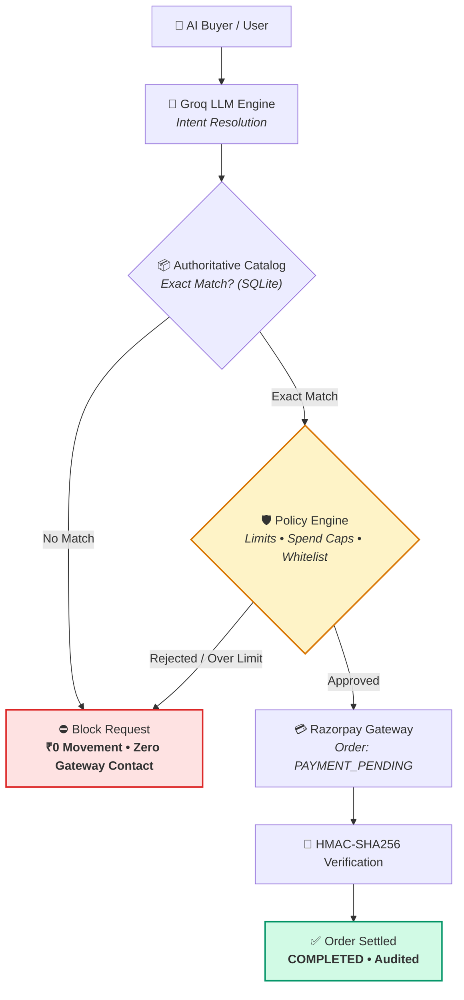
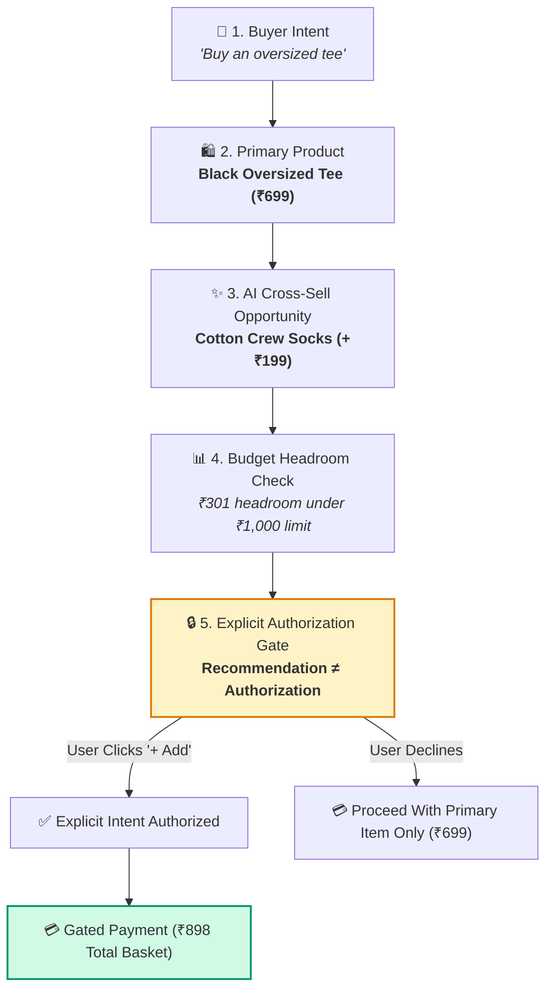
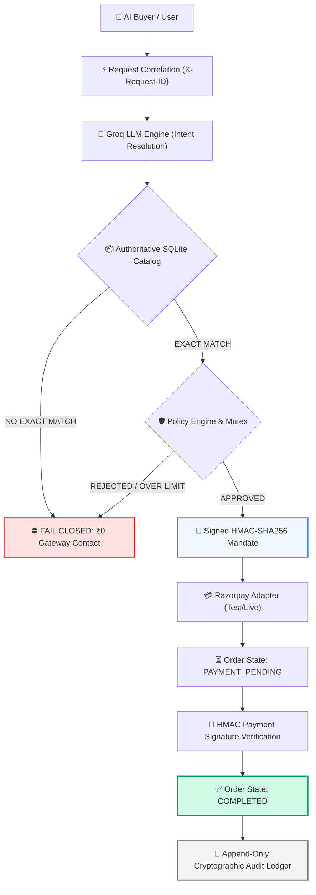
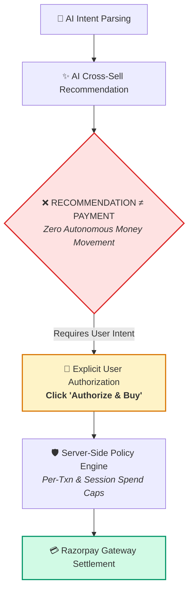
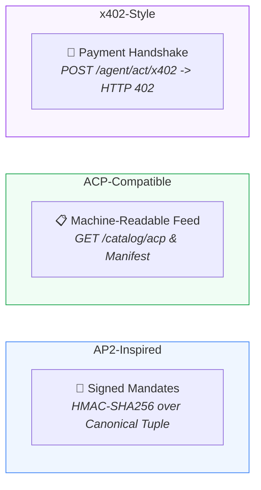
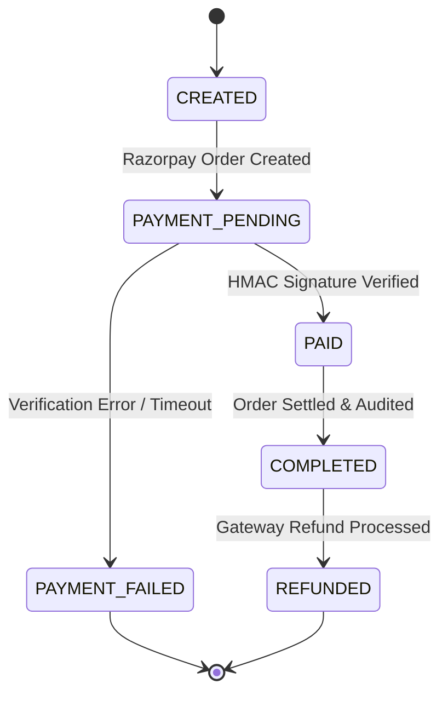

# 🛡️ THRESHOLD

### Safe AI-Native Commerce & Revenue Growth for Merchants

> **Make merchants sellable to AI buyers — while helping them grow revenue — with every money action explainable, bounded, and gated.**

**Built for the Razorpay AI Buildathon 2026 — Track: AI Growth & Agentic Commerce**

[](https://www.typescriptlang.org/)
[](https://react.dev/)
[](https://razorpay.com/)
[](https://groq.com/)
[](#-proof--automated-verification)
[](LICENSE)

---

## 🎯 What is Threshold?

AI buyers are shifting from **discovering products** to **executing purchases**. Threshold gives merchants the infrastructure to sell autonomously to AI agents while unlocking incremental revenue through intent-aware recommendations — without giving AI unconstrained authority over money.



---

## 💰 The Growth Loop: Recommendation ≠ Authorization

Threshold separates discovery intelligence from spending authority:



### Real-World Example:
```text
Primary Purchase:       Black Oversized Tee (₹699)
AI Revenue Opportunity: Cotton Crew Socks (₹199)
────────────────────────────────────────────────────
Potential Basket:       ₹898
Incremental Revenue:    +₹199
Policy Headroom:        ₹301 available under ₹1,000 cap

STATUS: RECOMMENDATION ONLY — USER AUTHORIZATION REQUIRED
```
> 🔒 **Core Rule**: An AI recommendation can never silently become a purchase.

---

## 🧠 Why Threshold?

| 🤖 AI Buyer Commerce | 📈 Merchant Growth |
|---|---|
| • **Natural-Language Purchasing**: Zero-shot Groq Llama 3.3 intent parsing | • **Contextual Cross-Sell & Upsell**: Budget-aware add-ons |
| • **Agent-Readable Feed**: Structured `/catalog/acp` product endpoint | • **Basket-Value Optimization**: Incremental GMV analysis |
| • **Discovery Manifest**: Machine-readable `/.well-known/agent-catalog.json` | • **Budget Headroom Analysis**: Stays within consumer caps |
| • **Independent Policy Gate**: Server-side spending & whitelist controls | • **AI Growth Campaigns**: One-click targeted buyer queries |
| • **Signed HMAC Mandates**: Cryptographic AP2-inspired authorization proofs | • **Live Lift Benchmark**: Real LLM intent-matching experiments |
| • **Razorpay State Machine**: Deterministic `PENDING` $\to$ `COMPLETED` lifecycle | • **Recommendation ≠ Authorization**: Gated user consent |

---

## 🏗️ Architecture



> **Every money action passes through catalog validation, server-side policy enforcement, and cryptographic payment verification before completion.**

---

## 🛡️ Safety & Governance

| Protection | What Threshold Does |
|---|---|
| **Spend Limits** | Enforces per-transaction (₹1,000) and cumulative session (₹1,500) caps |
| **Fail Closed** | Upstream AI failures, timeouts, or parse errors result in ₹0 money movement |
| **No Exact Match** | Missing SKUs trigger `NO_EXACT_MATCH`; zero autonomous product substitutions |
| **Idempotency** | Duplicate requests via `run_id` or `Idempotency-Key` reuse existing orders |
| **Concurrency Mutex** | `AsyncMutex` serializes concurrent spend evaluation, eliminating race conditions |
| **Payment Verification** | Cryptographic HMAC-SHA256 signature, amount, and currency validation |
| **Authorization Boundary** | Cross-sells require explicit user intent; AI cannot self-authorize charges |
| **Audit Ledger** | Append-only SQLite ledger records intent, policy reasons, mandates, and payments |



---

## 🌐 Protocol Interoperability



> **Note**: Threshold uses protocol-aligned interfaces for interoperability. It does **not** claim official AP2, ACP, or x402 third-party certification.

---

## 💳 Payment Lifecycle State Machine



---

## 🧪 Proof & Automated Verification

```text
┌────────────────────────────────────────────────────────┐
│             AUTOMATED TEST SUITE VERIFICATION          │
├────────────────────────────────────────────────────────┤
│                                                        │
│       Phase 7: Safety Regression Suite      12 / 12 ✓  │
│       Phase 8: State Machine & Observability 24 / 24 ✓ │
│       Phase 9: Production Integration       41 / 41 ✓  │
│       ───────────────────────────────────────────────   │
│       TOTAL VERIFIED TESTS                  77 / 77 ✓  │
│                                                        │
└────────────────────────────────────────────────────────┘
```

> **Verified Invariants**: Policy spend blocks contact ₹0 gateway · `NO_EXACT_MATCH` fails closed · Replay attacks deduplicated · Mutex prevents race-condition overspends · Tampered payments rejected · Webhook idempotency · Append-only audit integrity.

---

## 🚀 Quick Start

### 1. Clone & Setup
```bash
git clone https://github.com/alifosaur/Threshold.git
cd Threshold
```

### 2. Configure Environment
```bash
cp .env.example .env
cp backend/.env.example backend/.env
```

Edit `backend/.env`:
```env
PORT=5000
NODE_ENV=development
GROQ_API_KEY=your_groq_api_key_here
RAZORPAY_MODE=test
RAZORPAY_KEY_ID=your_razorpay_key_id
RAZORPAY_KEY_SECRET=your_razorpay_key_secret
RAZORPAY_WEBHOOK_SECRET=your_webhook_secret_here
AGENT_API_TOKEN=th_agent_sec_dev_token_2026
POLICY_SIGNING_SECRET=th_ap2_mandate_sec_2026
```

### 3. Run Backend
```bash
cd backend
npm install
npm run build
npm run dev
```
*Backend runs at `http://localhost:5000`.*

### 4. Run Frontend
```bash
cd ../frontend
npm install
npm run build
npm run dev
```
*Frontend runs at `http://localhost:3000`.*

### 5. Run Test Suites
```bash
node backend/test_phase7_regression.mjs
node backend/test_phase8.mjs
node backend/test_phase9.mjs
```

---

## 🔌 Key APIs

```text
AI COMMERCE & DISCOVERY
POST /agent/act                     # Execute purchasing intent with policy gating
POST /agent/act/x402                # Execute x402 payment-required handshake
GET  /catalog/acp                   # ACP-formatted product feed
GET  /.well-known/agent-catalog.json# Machine-readable discovery manifest

POLICY & GOVERNANCE
GET  /policy                        # Inspect spend limits & session spend
POST /policy                        # Update limits & emergency policy lock

GROWTH INTELLIGENCE
POST /growth/simulate-lift          # Run live intent-matching benchmark
POST /growth/campaign               # Generate targeted AI buyer campaigns

PAYMENT LIFECYCLE
POST /payments/verify               # Verify HMAC signature & transition to COMPLETED
POST /payments/webhook              # Ingest & deduplicate gateway webhooks
POST /payments/refund               # Execute refund & transition to REFUNDED
GET  /payments/reconciliation       # Payment ledger reconciliation report

DIAGNOSTICS & DEMO
GET  /health/detailed               # System components & metrics
POST /demo/safety                   # 1-click 3-scenario judge safety runner
```

---

## ⚠️ Honest Scope & Limitations

- **Gateway Mode**: Demonstrated in Razorpay Test Mode with deterministic offline fallback simulator when keys are omitted.
- **Growth Metrics**: Lift numbers are calculated via live Groq intent-matching against real catalog SKUs and labeled as **Simulated Benchmarks**, not guaranteed revenue.
- **Protocol Framing**: AP2, ACP, and x402 references denote schema-aligned compatibility layers, not formal third-party accreditations.

---

## 👨‍💻 Built For

### Razorpay AI Buildathon 2026
**Track: AI Growth & Agentic Commerce**

> *"Threshold — because when AI gets access to money, autonomy needs a boundary."*

---

## 📄 License

MIT License. Built for the Razorpay AI Buildathon 2026.


